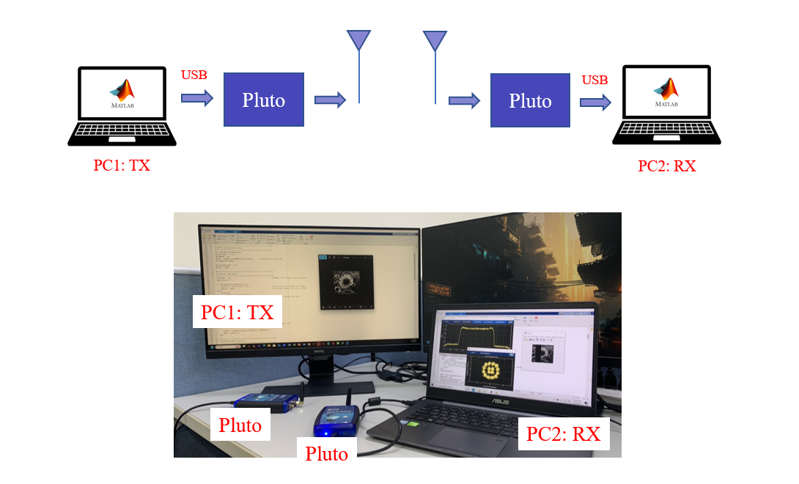

# DVB-S2 Transceiver Lab with ADALM-PLUTO

This repository contains an **educational lab project** demonstrating **DVB-S2 packet transmission and reception** using the [ADALM-PLUTO SDR](https://www.analog.com/en/resources/evaluation-hardware-and-software/evaluation-boards-kits/adalm-pluto.html).  
The project is designed as a **hands-on teaching material** to help students learn about **satellite communication baseband processing**.

---

## 📡 System Overview
- **Platform:** MATLAB / Simulink + ADALM-PLUTO SDR  
- **Experiment Goal:** Transmit DVB-S2 packets over-the-air and recover them at the receiver  
- **Applications:** Satellite communication, digital modulation/demodulation, synchronization  

---

## 🚀 DVB-S2 Transmitter Chain
The DVB-S2 transmitter generates baseband packets and processes them through the following stages:

1. Stream adaptation (BBFrame generation)  
2. Scrambling (PRBS)  
3. BCH & LDPC encoding  
4. Interleaving  
5. Constellation mapping (QPSK/8PSK/APSK)  
6. Physical Layer (PL) framing with pilots  
7. Pulse shaping  
---

## 📶 DVB-S2 Receiver Chain
The receiver recovers the input bitstream by performing:

1. DC offset compensation  
2. Automatic Gain Control (AGC)  
3. Frame synchronization  
4. Coarse & fine frequency offset correction  
5. Residual carrier & phase noise compensation  
6. PL header decoding & data recovery  

---

## 🖼️ Example Test: Image Transmission
As part of the lab, a grayscale image is transmitted as a DVB-S2 packet stream and successfully reconstructed at the receiver.

<p align="center">
  
</p>

---

## 📂 Repository Structure
```
├── src/          # MATLAB source code for Tx/Rx
├── images/       # Figures and block diagrams
├── docs/         # Lab instructions
└── README.md
```

---

## 📖 References
- ETSI EN 302 307-1: DVB-S2 Standard  
- [MathWorks DVB-S2 Transmitter Example](https://ww2.mathworks.cn/help/satcom/ug/dvbs2_transmitter_using_sdr.html)  
- [MathWorks DVB-S2 Receiver Example](https://ww2.mathworks.cn/help/satcom/ug/dvbs2_receiver_using_sdr.html)  
- [ADALM-PLUTO SDR](https://www.analog.com/en/resources/evaluation-hardware-and-software/evaluation-boards-kits/adalm-pluto.html)  

---

## 🎯 Highlights
- Complete **end-to-end DVB-S2 system** on Pluto SDR  
- Multi-mode modulation support (QPSK, 8PSK, APSK)  
- Includes **lab materials** for hands-on communication system experiments  
